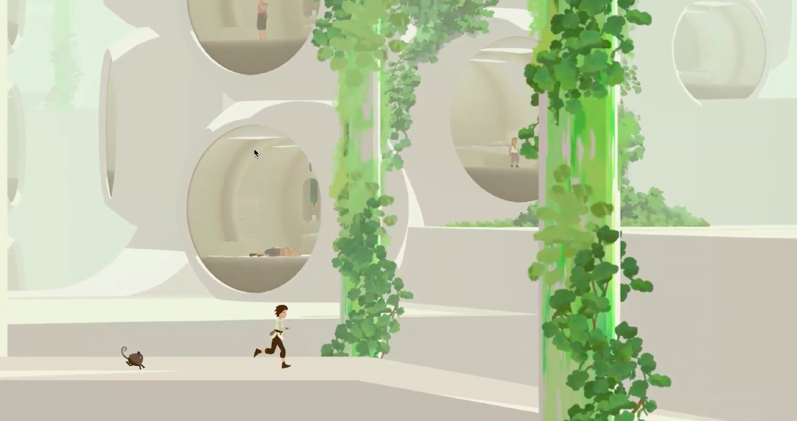
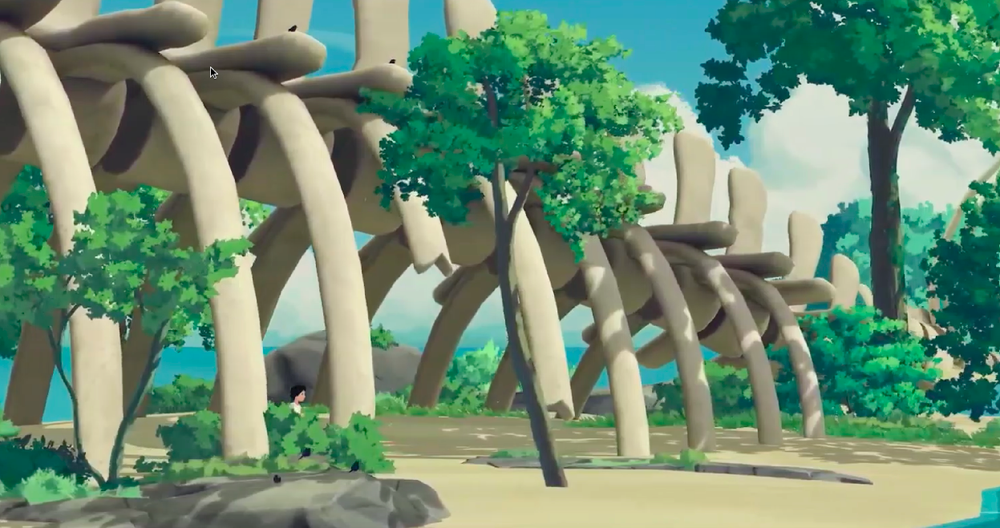
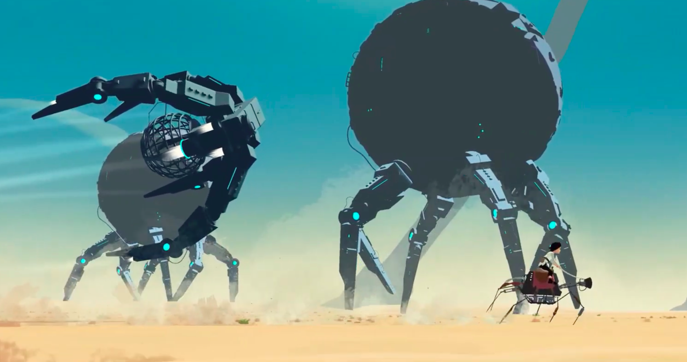
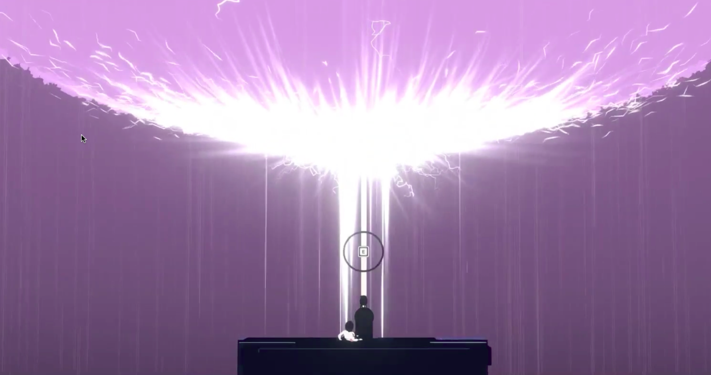
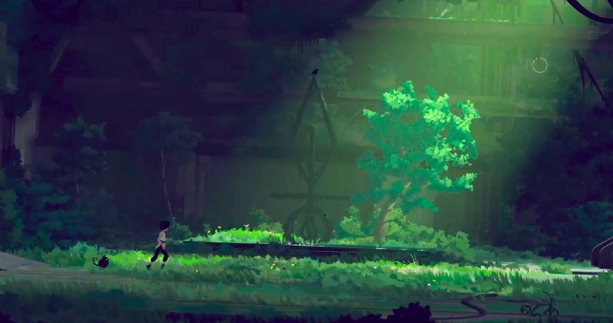
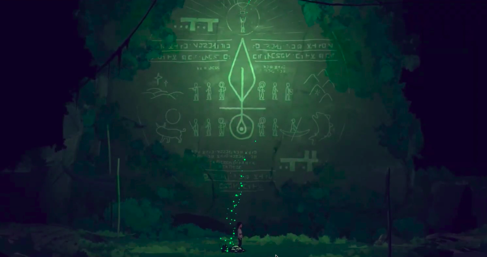
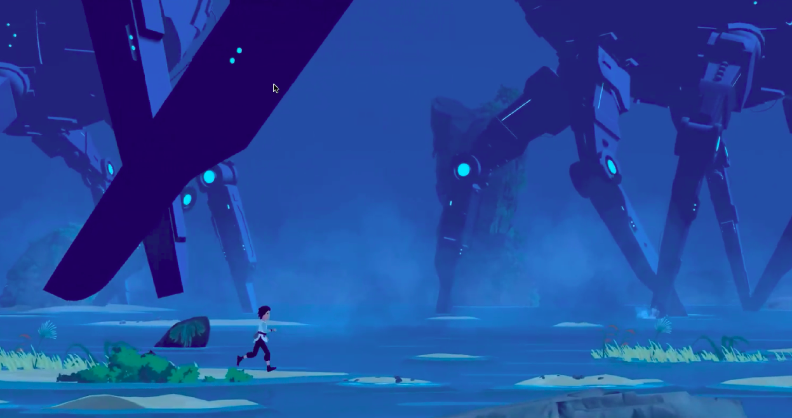
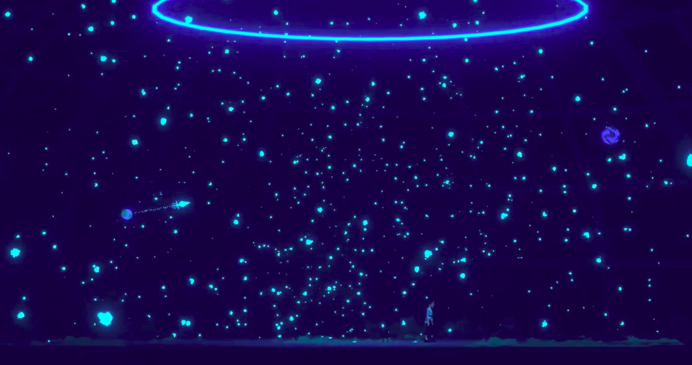

# Game-Designing
Game Designing Exercises, Presentations and Project

## Courses Info
- Teacher : Dr. Mohammad Hoseein Rezvani
- Score : 19 / 20
- Semester : 8

## Projects Images
#### Presentation Project (Planet of Lana)

  
  
  
  
  
  
  
  

